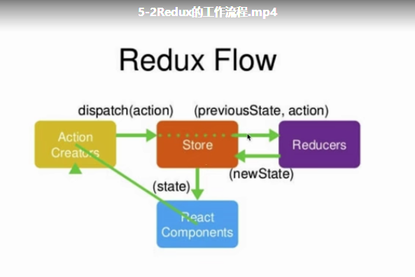

# redux的工作流程和原理
  
如上图：  
React Component----------借书人  
Action Creators----------借书的动作  
Store--------------------图书馆管理员   
Reducers-----------------图书记录册  

借书人(React Component)使用借书动作(Action Creators)向图书管理员（store）借书，store查阅图书记录册(Reducers)，然后借书给借书人(React Component)

# 如何在代码中实现redux
## 安装
npm install redux

## 创建一个带有图书记录册reducer的图书管理员store
1. 使用createStore创建一个store对象
2. 创建一个带默认值的reducer实际上就是一个返回state的函数
3. 将reducer放入store参数中
4. 在组件中引入store，并使用store.getState()方法获取对应的state值
```js
// src/store/index.js
import { createStore } from 'redux'
import reducer from './reducer'
// 创建一个带图书记录册reducer的图书管理员store
const store = createStore(reducer)

export default store;


// src/store/reducer.js
const defaultState = {
  inputValue: '123',
  list: [1,2,3]
}
export default (state = defaultState, action) => {
  return state;
}

// todolist.js
import React, { Component } from 'react'
import { Input, Button, List } from "antd";
// 引入store
import store from './store'


class TodoList extends Component {
  constructor(props) {
    super(props)
    this.addItem = this.addItem.bind(this)
    this.handleChange = this.handleChange.bind(this)
    // 获取数据
    this.state = store.getState();
  }
  render() {
    return (
      <div>
        <Input placeholder="请输入todoItem" value={this.state.inputValue} onChange={this.handleChange}/>
        < Button 
          type = "primary"
          onClick = {
            this.addItem
          }
        > 提交 </Button>
        <List
          bordered
          dataSource={this.state.list}
          renderItem={item => <List.Item>{item}</List.Item>}
        />
      </div>
    )
  }
  handleChange(e) {
    const value = e.target.value;
    console.log(value)
    this.setState(() => ({
      inputValue: value
    }))
  }
  addItem() {
    this.setState(() => {
      return {
        list: [...this.state.list, this.state.inputValue],
        inputValue: ''
      }
    },
    function () {
      console.log(this.state.list)
    }
  )}
}

export default TodoList;
```


## 改变store值，并在组件中接收新的store值
1. 创建一个action(就是一个对象)，格式为：
```js
  const action = { 
    type: 'action_type',  // 自定义命名动作
    value: 'xxxx'         // 要传递给reducer的值
  }
```
2. 使用dispatch将之前的state数据及要传递的动作action给store，store会自动将其传给reducer
```js
  store.dispatch(action)
```
3. reducer会收到动作，并作出相关处理，注意，reducer只能接收state的，不能直接改变state
```js
  export default (state, action) =>　{
    console.log(state);   // { inputValue:'', list: [] }
    console.log(action); //  { type: 'action_type', value: 'xxxx'  }
    if(action.type === 'action_type') {
      // 新建一个newState，深拷贝之前的state,然后在此基础上改变后返回newState，这样就改变了store
      const newState = JSON.parse(JSON.strigify(state))
      newState.inputValue = action.value;
      return newState;
    }
    return state;
  }
```

4. 组件使用subscribe监听store变化，并在组件中改变
```js
  constructor(props) {
    this.handleStoreChange = this.handleStoreChange.bind(this)
    // 监听到store的值，就执行this.handleStoreChange，handleStoreChange方法用于改变组件中的值
    store.subscribe(this.handleStoreChange)
  }
  render() {
    return (...)
  }
  handleStoreChange() {
    this.setState(store.getState())
  }
```


## 拆分ActionTypes  
当我们动作多时，就会存在多个判断action.type = 'xxxx'，而一旦哪个xxx拼写错误时，就无法按正常流程进行，且还不会有错误提示，对于调试是比较困难的。  
为了避免这种情况，我们推荐将字符串以变量或常量的方式存储起来，这样，如果拼写变量名或常量名错误时，将会有错误提示，方便我们及时精准定位到问题
```js
  // src/store/actionTypes.js
  export const CHANGE_INPUT_VALUE = 'change_input_value'
  export const ADD_TODOITEM = 'add_todoItem'
  export const DELETE_TODOITEM = 'delete_todoItem'

  // src/todolist.js
  import { CHANGE_INPUT_VALUE, ADD_TODOITEM, DELETE_TODOITEM } from './store/actionTypes'
  handleChange(e) {
    const action = {
      type: CHANGE_INPUT_VALUE, // 自定义的类型值，但键值必须为type
      value: e.target.value       // 键值对均可自定义
    }
  }
  //...

  // src/store/reducer.js
  import { CHANGE_INPUT_VALUE, ADD_TODOITEM, DELETE_TODOITEM } from './actionTypes'
  export default (state = defaultState, action) => {
    console.log(state, action)
    if(action.type === CHANGE_INPUT_VALUE) {//
      // 创建一个新的state，因为reducer可以接收state，但不能改变state值，所以要进行深拷贝
      const newState = JSON.parse(JSON.stringify(state));
      newState.inputValue = action.value;
      return newState;
    }
  }
  //...
```

## 创建一个统一Action Creators
像之前那样，如果动作很多，action会存在多个地方，到时不好管理，推荐使用一个统一的Action Creator去管理
```js
// src/store/actionCreator
import { CHANGE_INPUT_VALUE, ADD_TODOITEM, DELETE_TODOITEM } from './actionTypes'

export const getInputChangeAction = (value) => ({
  type: CHANGE_INPUT_VALUE,
  value
})

export const getAddItemAction = (value) => ({
  type: ADD_TODOITEM,
  value
})

export const getDeleteItemAction = (index) => ({
  type: DELETE_TODOITEM,
  index
})

// todolist.js
// import { CHANGE_INPUT_VALUE, ADD_TODOITEM, DELETE_TODOITEM } from './store/actionTypes'
import { getInputChangeAction, getAddItemAction, getDeleteItemAction} from './store/actionCreator'
 handleChange(e) {
    // const action = {
    //   type: CHANGE_INPUT_VALUE, // 自定义的类型值，但键值必须为type
    //   value: e.target.value     // 键值对均可自定义
    // }
    const action = getInputChangeAction(e.target.value)
    store.dispatch(action)
  }
  addItem() {
    // const action = {
    //   type: ADD_TODOITEM,
    //   value: this.state.inputValue
    // }
    const action = getAddItemAction(this.state.inputValue)
    store.dispatch(action)
  }
  deleteItem(index) {
    // const action = {
    //   type: DELETE_TODOITEM,
    //   index: index
    // }
    const action = getDeleteItemAction(index)
    store.dispatch(action)
  }
```


# 完整todolist例子
```js
// src/todolist.js
import React, { Component } from 'react'
import { Input, Button, List } from "antd";
import store from './store'
import { getInputChangeAction, getAddItemAction, getDeleteItemAction} from './store/actionCreator'
class TodoList extends Component {
  constructor(props) {
    super(props)
    this.addItem = this.addItem.bind(this)
    this.handleChange = this.handleChange.bind(this)
    this.handleStoreChange = this.handleStoreChange.bind(this)
    this.state = store.getState();
    store.subscribe(this.handleStoreChange) // 监听store的变化，自动执行函数
  }
  render() {
    return (
      <div>
        <Input placeholder="请输入todoItem" value={this.state.inputValue} onChange={this.handleChange}/>
        < Button 
          type = "primary"
          onClick = {
            this.addItem
          }
        > 提交 </Button>
        <List
          bordered
          dataSource={this.state.list}
          renderItem={(item,index) => <List.Item onClick={this.deleteItem.bind(this, index)}>{item}</List.Item>}
        />
      </div>
    );
  }
  handleChange(e) {
    const action = getInputChangeAction(e.target.value)
    store.dispatch(action)
  }
  handleStoreChange() {
    console.log('store changed')
    // 相当于 this.state = store.getState()
    this.setState(store.getState())
  }
  addItem() {
    const action = getAddItemAction(this.state.inputValue)
    store.dispatch(action)
  }
  deleteItem(index) {
    const action = getDeleteItemAction(index)
    store.dispatch(action)
  }
}

export default TodoList;


// src/store/index.js
import { createStore } from 'redux'
import reducer from './reducer'
// 创建一个带图书记录册reducer的图书管理员store
const store = createStore(
  reducer,
  window.__REDUX_DEVTOOLS_EXTENSION__ && window.__REDUX_DEVTOOLS_EXTENSION__()
  )

export default store;


// src/store/actionTypes.js
export const CHANGE_INPUT_VALUE = 'change_input_value'
export const ADD_TODOITEM = 'add_todoItem'
export const DELETE_TODOITEM = 'delete_todoItem'
 
 // src/store/actionCreator.js
 import { CHANGE_INPUT_VALUE, ADD_TODOITEM, DELETE_TODOITEM } from './actionTypes'

export const getInputChangeAction = (value) => ({
  type: CHANGE_INPUT_VALUE,
  value
})
export const getAddItemAction = (value) => ({
  type: ADD_TODOITEM,
  value
})
export const getDeleteItemAction = (index) => ({
  type: DELETE_TODOITEM,
  index
})

// src/store/reducer.js
import { CHANGE_INPUT_VALUE, ADD_TODOITEM, DELETE_TODOITEM } from './actionTypes'

const defaultState = {
  inputValue: '',
  list: []
}

export default (state = defaultState, action) => {
  console.log(state, action)
  if(action.type === CHANGE_INPUT_VALUE) {//
    // 创建一个新的state，因为reducer可以接收state，但不能改变state值，所以要进行深拷贝
    const newState = JSON.parse(JSON.stringify(state));
    newState.inputValue = action.value;
    return newState;
  }
  if(action.type === ADD_TODOITEM) {
    const newState = JSON.parse(JSON.stringify(state))
    newState.list.push(action.value)
    newState.inputValue = ''
    return newState
  }
  if(action.type === DELETE_TODOITEM) {
    const newState = JSON.parse(JSON.stringify(state))
    newState.list.splice(action.index, 1)
    return newState
  }
  return state;
}
```


# redux小结
三大原则:
* store是唯一的  
    只在index.js中创建一个store，不会有第二个
* 只有store能够改变自己的内容  
    所以reducer不能直接改变state，而是将newState返回给store自己修改
* reducer必须是一个纯函数，即给定固定的输入，就一定有固定的输出，而且不能有副作用  
    即不能有ajax请求和时间new Date()这种变化的操作。副作用是对参数本身有修改  


核心API：
* createStore: 创建store
* store.dispatch: 将action传递给store，进而给reducer处理
* store.getState: 获取store的值
* store.subscribe: 监听store的改变 